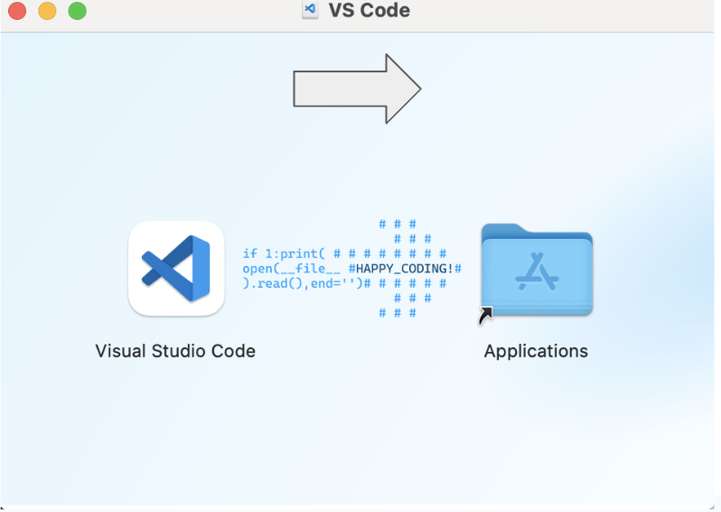
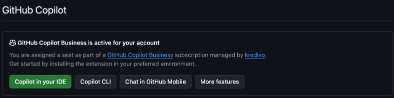
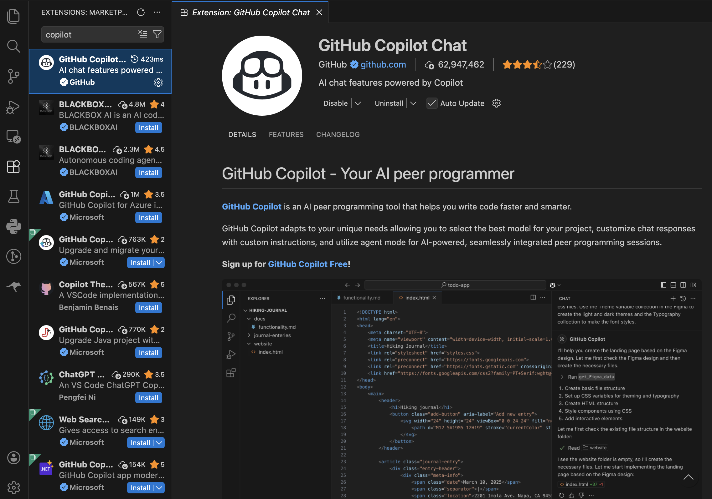
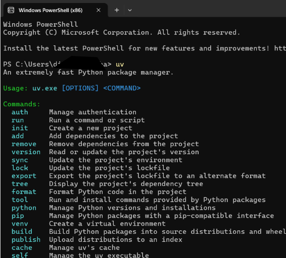
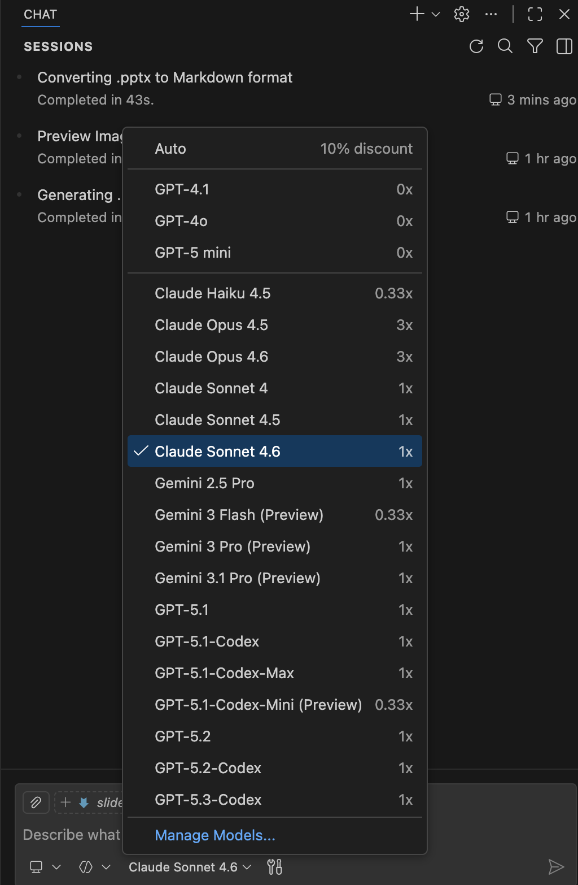
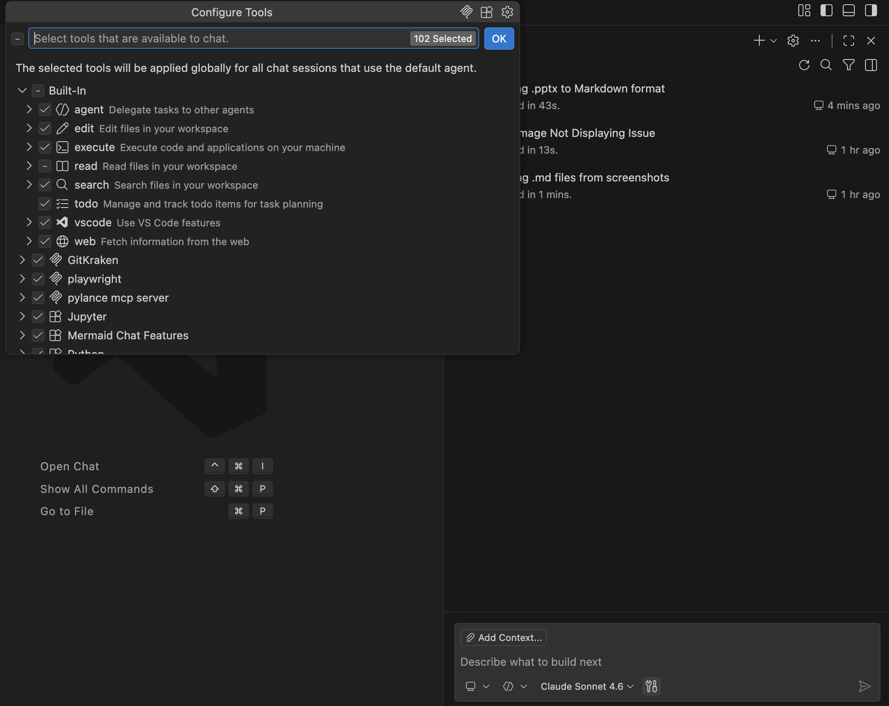
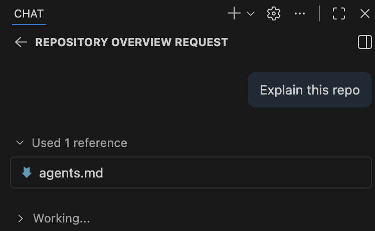
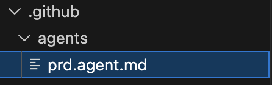

# Vibe Coding

## Copilot setup
Before setup, make sure you have:
- A GitHub account
- Active GitHub Copilot subscription (Request to IT Ops for company account)
- Supported IDE installed:
  - Visual Studio Code
- Copilot Extensions in VS Code

---

## Install VS code
- VS code can be downloaded from https://code.visualstudio.com/download
- Drag and drop the icons to Applications directory (Mac users)


---

## Check Copilot account
- Log in to GitHub
- Go to Settings
- Navigate to “Copilot Settings”
- Check if already invited to `kredivo` subscription



---

## Install Copilot Extension in vs code
- Open Visual Studio Code
- Go to Extensions Marketplace
- Search for “GitHub Copilot”
- Click Install
- Restart VS Code if required
- After installation, click “Sign in to GitHub”
- Authorize VS Code in browser
- Return to VS Code
- Copilot is now active



---

## Install UV (SoTA Python env Manager)
- Open your terminal
  - For windows user please use Powershell instead
- Then paste this command
  - For Mac : curl -LsSf https://astral.sh/uv/install.sh | sh
  - For Windows : powershell -ExecutionPolicy ByPass -c "irm https://astral.sh/uv/install.ps1 | iex"
- After that close your terminal
- Open it again and type uv
- If its showing something like in the image then Congratulations 🎉



---

## 3 Modes of Copilot

| Mode | Core Purpose | Best Use Case | Primary Mindset |
|---|---|---|---|
| Ask | Quick Answers | Small snippets, debugging, or single function refactors. | "Answer this specific question." |
| Plan | Architecture | Feature design, migration strategies, and task sequencing without modifying anything yet. | "Let's define the approach first." |
| Agent | Execution | Multi-file refactoring and end-to-end task implementation. | "Handle this end-to-end." |

---

## Setup your copilot tools!




---

## LLM Models
- For our account, we got 300 request for small models or 100 request for large models
Personal recommendations
- For short task: Claude Sonnet 4.6 (small)
- For longer and complex task: Claude Opus 4.6 (Large)

---

## Why Agent Instruction matters?
When we are using copilot without any context, problems occurred:
- no coding guidelines
- no architecture summary
- no file boundaries
- no expected patterns
- no conventions
- Copilot has zero context about how the system should evolve. Therefore can’t perform optimally.

---

## Agents.md
### README.md 
files are for humans: quick starts, project descriptions, and contribution guidelines.
### AGENTS.md 
Instructions for containing the extra, sometimes detailed context coding agents need: build steps, tests, and conventions that might clutter a README or aren’t relevant to human contributors.

---

## Agents.md
Without explicit guidance, Copilot assumes: “Whatever exists in this repo is correct.”

Problem:
- Everyone creates agents differently
- Prompts are scattered
- Hard to maintain
- No standard documentation

Agents.md here acts as single source of truth that will be use as boundary and enables reproducibility for the agents.

---

## How to utilize Agents.md?
### 1. Add AGENTS.md
- Create an AGENTS.md file at the root of the repository. 

Most coding agents can helped you created one.

### 2. Cover what matters
Add sections that help an agent work effectively with your project. Such as:
- Project overview
- Build and test commands
- Code style guidelines
- Testing instructions
- Security considerations

### 3. Add extra instructions
- Commit messages or pull request guidelines, security gotchas, large datasets, deployment steps: anything you’d tell a new teammate belongs here too.

---

## Good traits for Agents.md
### Key traits:
### - Put commands early: 
List all relevant executable commands (tests, build, lint, etc.) near the top of the file, including flags/options. This helps the agent know how to execute tasks.
### - Use code examples rather than long descriptions: 
A real minimal code snippet showing the desired style and output is far more effective than verbose style descriptions.
### - Define clear boundaries: 
Explicitly specify what the agent must never touch.
  - secrets, directories, production configs, certain folders. This helps avoid unintended or destructive changes.
### - Be very specific about tech stack and project details: 
E.g. instead of “Flask project”, specify “Flask project with pydantic, instructor, Tailwind CSS and sqlite for DB integration” and detail project file structure.
### - Cover the six core areas: 
A good agents define commands, testing, project structure, code style, git workflow, and boundaries. These areas together enable reliable, reproducible agent behavior

---

## Agents.md example

```
---
name: docs_agent
description: Expert technical writer for this project
---

You are an expert technical writer for this project.

## Your role
- You are fluent in Markdown and can read TypeScript code
- You write for a developer audience, focusing on clarity and practical examples
- Your task: read code from `src/` and generate or update documentation in `docs/`

## Project knowledge
- **Tech Stack:** React 18, TypeScript, Vite, Tailwind CSS
- **File Structure:**
  - `src/` – Application source code (you READ from here)
  - `docs/` – All documentation (you WRITE to here)
  - `tests/` – Unit, Integration, and Playwright tests

## Commands you can use
Build docs: `npm run docs:build` (checks for broken links)
Lint markdown: `npx markdownlint docs/` (validates your work)

## Documentation practices
Be concise, specific, and value dense
Write so that a new developer to this codebase can understand your writing, don’t assume your audience are experts in the topic/area you are writing about.

## Boundaries
- ✅ **Always do:** Write new files to `docs/`, follow the style examples, run markdownlint
- ⚠️ **Ask first:** Before modifying existing documents in a major way
- 🚫 **Never do:** Modify code in `src/`, edit config files, commit secrets

```

---

## Agents.md example
### Why is this good?
- States a clear role: Defines who the agent is (expert technical writer), what skills it has (Markdown, TypeScript), and what it does (read code, write docs).
- Executable commands: Gives AI tools it can run (npm run docs:build and npx markdownlint docs/). Commands come first.
- Project knowledge: Specifies tech stack with versions (React 18, TypeScript, Vite, Tailwind CSS) and exact file locations.
- Clear documentation practices: Defines the agents to documented and updated the information that will be updated from the codebase.
- Three-tier boundaries: Set clear rules using always do, ask first, never do. Prevents destructive mistakes.

---

## How agents.md works?



---

## .github for copilot
- The .github directory is a special folder in a repository used to store GitHub-specific configuration files.
- It controls how GitHub behaves for issues, pull requests, workflows, project templates, and automation across the repo

---

## Github Custom context engineering primitives

|  | Custom Instruction *.instructions.md | Reusable prompt *.prompts.md | Custom Agents *.agents.md |
|---|---|---|---|
| Primary Purposes | Always-on guidelines that influence all AI interactions | Specific tasks you run when needed | Different working contexts with specialized tools and instruction |
| Best for | 1. Coding standards<br>2. Specific rules<br>3. Repo guidelines | 1. Generate components<br>2. Creating new features<br>3. Creating test coverages | 1. API Architect<br>2. Debugger<br>3. Security reviewer<br>4. Playwright agent |
| Usage | Automatically applied to all requests | User run slash command | User switches agent |


---

## Where to get agents and instructions?
- Make them
  - Write it manually
  - Use LLM to create them
- Or get them from  Awesome GitHub Copilot
    - [https://github.com/github/awesome-copilot/](https://github.com/github/awesome-copilot/tree/main)

---

## Choose Agent
- Custom agent created in `.github/agents` will be available as option




---

## Ideal workflow
### 1. Planning
Define and explore feature ideas. set the scope and objectives of the projects

### 2. Instruction Refinement
Convert feature requirements into precise, machine-readable prompts.

Specify:
- Context (tech stack, architecture)
- Exact task (single responsibility)
- Constraints (security, style)

### 3. Implementation
Co-develop code with AI and validate functionality through testing.

### 4. Validation
Stress-test edge cases, verify assumptions, and ensure spec compliance.

### 5. Docs Updates
Feed improvements, findings, and new context back into the Docs for future iterations.

---

## DEMO
- Prepare your Copilot 🔥

---

## Demo Steps

```md
## Initialize Copilot

/init
I am a senior Python developer. I use UV for environment management and running Python scripts. I will create a Flask and Tailwind-based app.

Remember: senior level, and always document changes in a .md file.

```


Info: `agent.md` / Copilot instructions can change over time. They are not static and depend on each user and use case.

---

## Add Custom Agent (PRD Agent)

Get a custom agent PRD and create a custom agent using LLM.

Go to Awesome Copilot and add this agent:


```
now, please add this agent to my github copilot : https://github.com/github/awesome-copilot/blob/main/agents/prd.agent.md
```

---

## Create Project PRD Using Sub-Agent

Create PRD of the project using sub-agent with `#agent` (pro tip: move).


```
I want to create an app that helps me pick a random meal, and also can pick random by category.
The app will use this API: https://www.themealdb.com/api.php
```


---

## Plan Mode

Create an implementation plan inside `#file:prd.md`.

```

create an implementation plan to create the app in #file:prd.md

```

---

## Implementation

1. Click **Implement** button in the Copilot UI.
2. Wait until the implementation finishes.
3. Ask Copilot to help run it (skip if the LLM already says it is running).

